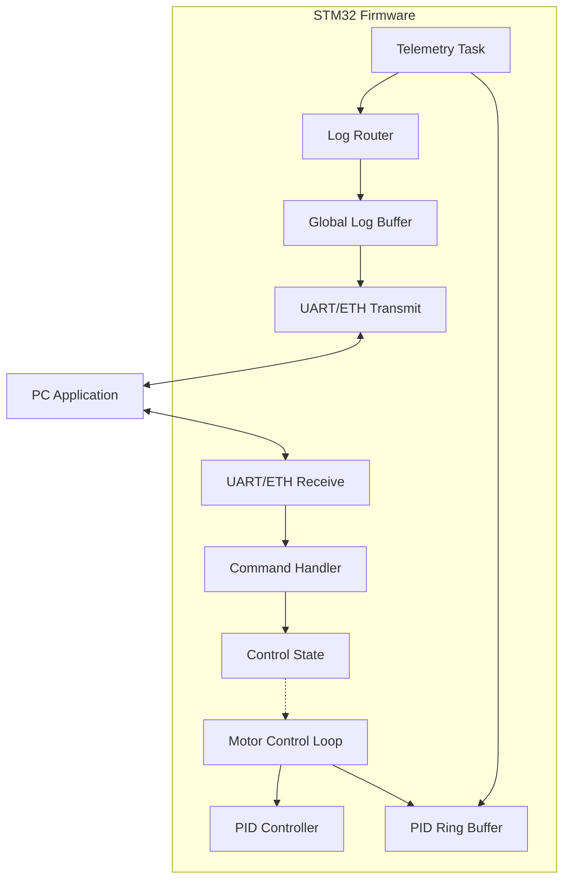

# ProjeckKSMSIM: Motor Control System with Telemetry

This project is a complete motor control system consisting of an STM32-based firmware and a Qt-based PC application. It features a PID-based position controller, real-time telemetry, and dual-mode communication (UART and Ethernet).

## Features

- **PID Position Control**: High-frequency (50Hz) PID loop running on STM32F7 using CMSIS-DSP.
- **Real-time Telemetry**: High-speed data logging of position, speed, setpoint, and control output.
- **Dual Interface**:
    - **UART**: DMA-based transmission and reception.
    - **Ethernet**: LwIP-based TCP server for commands/telemetry and UDP beacon for device discovery.
- **JSON Protocol**: All communications use NDJSON (Newline Delimited JSON) for easy parsing.
- **PC Dashboard**: Qt application featuring an interactive angle dial, real-time plotting (via telemetry), and console for direct command entry.

## Project Structure

- `STM32/`: Firmware source code for STM32F767ZI.
    - `Core/`: ST-generated HAL initialization and system configuration.
    - `Components/`: User-written logic (PID, Log Router, Communication Tasks).
- `PC_APP/`: Qt-based desktop application.
    - `Inc/`, `Src/`: C++ sources for the UI and communication backend.

## Hardware Requirements

- **Microcontroller**: STM32F767ZI (Nucleo-144).
- **Actuator**: DC Motor with an incremental encoder.
- **Driver**: H-Bridge driver compatible with PWM and Direction signals.
- **Connectivity**: USB-Micro for ST-Link/UART and RJ45 for Ethernet.

## Communication Protocol

The system uses a JSON-based command/response protocol.

### Commands (PC -> STM32)
- **Set Position**: `{"cmd":"setpoint", "deg":45.5}`
- **Switch Output**: `{"cmd":"out", "value":"ETH"}` (or `"UART"`)

### Telemetry (STM32 -> PC)
- **Data Point**: `{"type":"pid", "t":12345, "pos":10.2, "spd":5.0, "sp":45.5, "out":20.0}`
- **Ack**: `{"type":"ack", "out":"ETH"}`

## Setup and Build

### STM32 Firmware
1. Open the `STM32/` project in STM32CubeIDE or CLion.
2. Ensure you have the `ARM CMSIS-DSP` library enabled.
3. Build and flash the project to the Nucleo-144 board.

### PC Application
1. Install Qt 6 (or compatible version).
2. Open `PC_APP/CMakeLists.txt` in Qt Creator or your preferred IDE.
3. Build and run the application.
4. Select the connection mode (Serial or Ethernet) to start controlling the motor.

## Block Diagram

Below is the high-level architecture of the user-written components in the firmware:

## Authors
- **Krzysztof Sawicki**
- 
-
